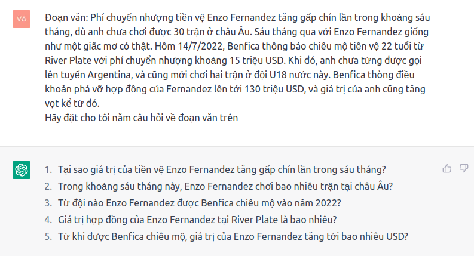

# [doc2query-viT5](https://huggingface.co/r1ck/doc2query-viT5)

This is a [doc2query](https://arxiv.org/abs/1904.08375) model based on [viT5](https://huggingface.co/VietAI/vit5-base)

It can be used for:
- **Document expansion**: You generate for your paragraphs 20-40 queries and index the paragraphs and the generates queries in a standard BM25 index like Elasticsearch, OpenSearch, or Lucene. The generated queries help to close the lexical gap of lexical search, as the generate queries contain synonyms. Further, it re-weights words giving important words a higher weight even if they appear seldomn in a paragraph. 
- **Domain Specific Training Data Generation**: It can be used to generate training data to learn an embedding model. 

## Usage
```python
from transformers import AutoTokenizer, AutoModelForSeq2SeqLM
import torch

model_name = 'r1ck/doc2query-viT5'
tokenizer = AutoTokenizer.from_pretrained(model_name)
model = AutoModelForSeq2SeqLM.from_pretrained(model_name)

text = "Chiến tranh Lạnh (1947-1991, tiếng Anh: Cold War) là chỉ đến sự căng thẳng địa chính trị và xung đột ý thức hệ đỉnh điểm giữa hai siêu cường (đứng đầu và đại diện hai khối đối lập): Hoa Kỳ (chủ nghĩa tư bản) và Liên Xô (chủ nghĩa xã hội)."


def create_queries(para):
    input_ids = tokenizer.encode(para, return_tensors='pt')
    with torch.no_grad():
        # Here we use top_k / top_k random sampling. It generates more diverse queries, but of lower quality
        sampling_outputs = model.generate(
            input_ids=input_ids,
            max_length=64,
            do_sample=True,
            top_p=0.95,
            top_k=10, 
            num_return_sequences=5
            )
        
        # Here we use Beam-search. It generates better quality queries, but with less diversity
        beam_outputs = model.generate(
            input_ids=input_ids, 
            max_length=64, 
            num_beams=5, 
            no_repeat_ngram_size=2, 
            num_return_sequences=5, 
            early_stopping=True
        )


    print("Paragraph:")
    print(para)
    
    print("\nBeam Outputs:")
    for i in range(len(beam_outputs)):
        query = tokenizer.decode(beam_outputs[i], skip_special_tokens=True)
        print(f'{i + 1}: {query}')

    print("\nSampling Outputs:")
    for i in range(len(sampling_outputs)):
        query = tokenizer.decode(sampling_outputs[i], skip_special_tokens=True)
        print(f'{i + 1}: {query}')

create_queries(text)

```

**Note:** `model.generate()` is non-deterministic for top_k/top_n sampling. It produces different queries each time you run it.

## Training
This model fine-tuned [VietAI/vit5-base](https://huggingface.co/VietAI/vit5-base) on 30k vietnamese passage-question pairs

## doc2query-viT5 vs ChatGPT (just for fun)
doc2query-viT5
```
Paragraph:
"""Phí chuyển nhượng tiền vệ Enzo Fernandez tăng gấp chín lần trong khoảng sáu tháng, dù anh chưa chơi được 30 trận ở châu Âu. Sáu tháng qua với Enzo Fernandez giống như một giấc mơ có thật. Hôm 14/7/2022, Benfica thông báo chiêu mộ tiền vệ 22 tuổi từ River Plate với phí chuyển nhượng khoảng 15 triệu USD. Khi đó, anh chưa từng được gọi lên tuyển Argentina, và cũng mới chơi hai trận ở đội U18 nước này. Benfica thòng điều khoản phá vỡ hợp đồng của Fernandez lên tới 130 triệu USD, và giá trị của anh cũng tăng vọt kể từ đó."""

Questions
Beam Outputs:
1: Tiền vệ 22 tuổi Enzo Fernandez được Benfica chiêu mộ từ đâu?
2: Tiền vệ Enzo Fernandez đã chơi bao nhiêu trận ở châu Âu?
3: Tiền vệ Enzo Fernandez đã chơi bao nhiêu trận ở đội U18?
4: Tiền vệ 22 tuổi của Benfica là ai?
5: Tiền vệ 22 tuổi của Benfica là ai

Sampling Outputs:
1: Khi nào thì Benfica thông báo mua lại tiền vệ Enzo Fernandez?
2: Tiền vệ 22 tuổi Enzo Fernandez đã có những quyết định gì?
3: Tiền vệ Enzo Fernandez từng thi đấu bao nhiêu trận
4: Giá trị của tiền vệ 18 tuổi Enzo Fernandez tăng vọt trong khoảng thời gian bao lâu?
5: Tiền vệ 22 tuổi được Benfica chiêu mộ từ River Plate với giá bao nhiêu?
```
ChatGPT
